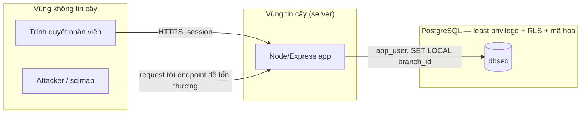

# Threat model & Data Flow — App demo (Người A)

Làm trước khi code, theo đúng thứ tự thiết kế bảo mật chuẩn: hiểu luồng dữ liệu và ranh giới tin cậy trước, rồi mới viết code. Tài liệu này là artifact riêng cho portfolio/CV — không bắt buộc đưa nguyên văn vào báo cáo đồ án.

## Data Flow Diagram

Ranh giới tin cậy quan trọng nhất nằm giữa **app** và **database**. Giả định thiết kế: app có thể bị khai thác hoàn toàn (SQL Injection, IDOR), nhưng các cơ chế ở tầng DB (Row-Level Security, mã hóa cột, least privilege) là lớp phòng thủ độc lập, không dựa vào giả định "app luôn kiểm tra đúng".

## STRIDE cơ bản

| Loại đe dọa | Ví dụ trong hệ thống | Kiểm soát tương ứng |
| --- | --- | --- |
| Spoofing | Giả mạo tài khoản nhân viên | Hash mật khẩu bằng bcrypt, session/JWT cho xác thực |
| Tampering | Sửa `id` trong URL để xem đơn hàng của khách/chi nhánh khác (IDOR) | Row-Level Security ở tầng DB — chặn được kể cả khi app quên kiểm tra quyền |
| Repudiation | Nhân viên chối đã xóa/sửa dữ liệu | pgAudit ghi log mọi hành vi ghi/DDL/đổi quyền |
| Information Disclosure | SQL Injection dump bảng `customers` | Mã hóa cột `cccd`/`so_the` bằng pgcrypto — dump được nhưng chỉ thấy bytea vô nghĩa |
| Denial of Service | Truy vấn nặng làm chậm hệ thống | Ngoài phạm vi đồ án — ghi rõ trong phần giới hạn của báo cáo |
| Elevation of Privilege | App bị chiếm quyền, thử `DROP TABLE`/đổi quyền | DB role `app_user` không có quyền DDL (least privilege) |

## Ghi chú cho báo cáo/phỏng vấn

Điểm cốt lõi cần nói được: thiết kế này theo tinh thần **defense in depth** — không có kiểm soát nào một mình là đủ, mỗi lớp bù đắp cho khả năng lớp trước bị vượt qua. STRIDE ở trên là cách hệ thống hóa "kiểm soát nào bù cho đe dọa nào", giúp trả lời tốt câu hỏi phỏng vấn kiểu "tại sao bạn chọn thiết kế này mà không phải chỉ validate input".
