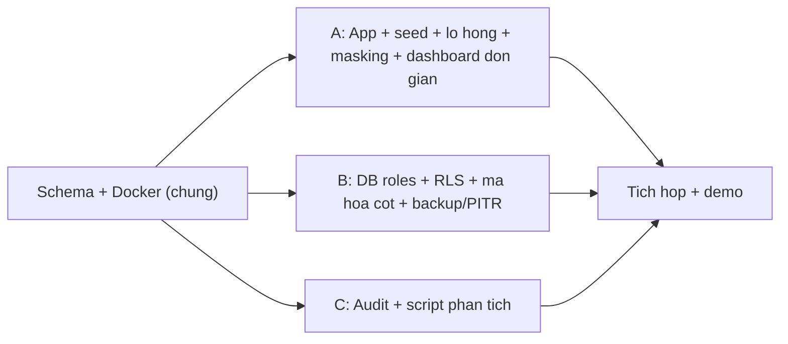

# Phân công & tiến độ đồ án: Bảo mật cơ sở dữ liệu nhiều lớp trên PostgreSQL

> Tổng hợp toàn bộ công việc của cả 3 người (A/B/C) theo doc phân công nhóm, kèm trạng thái
> thực tế tính đến hiện tại. Cập nhật lần cuối: 19/09/2026.
>
> Ký hiệu: ✅ Đã xong · ⚠️ Làm một phần · ❌ Chưa làm

## Người A (bạn) — 7/9 đã xong

| # | Việc cần làm | Trạng thái | Ghi chú |
|---|---|---|---|
| 1 | Xây app Node/Express | ✅ | Kết nối PostgreSQL bằng `app_user` (không dùng superuser), endpoint đăng nhập/khách hàng/đơn hàng, giao diện tối giản (JSON API) |
| 2 | Seed dữ liệu Faker.js (5.000–10.000 dòng) | ✅ | ~6.600 khách hàng, ~10.000 đơn hàng, ~4.000 thanh toán, rải đều 3 chi nhánh |
| 3 | Sơ đồ luồng dữ liệu + threat model (STRIDE) | ✅ | `docs/a-threat-model.md` |
| 4 | Cài 2 lỗ hổng cố ý (SQL Injection + IDOR) | ⚠️ | Đã cài và khai thác thành công bằng tay (UNION-based đọc `staff.password_hash`, đổi ID đơn hàng). **Chưa chạy sqlmap thật** như doc yêu cầu — mới test thủ công qua `curl` |
| 5 | Báo cáo dạng pentest cho 2 lỗ hổng (portfolio/CV) | ❌ | Đã hoãn theo yêu cầu của bạn |
| 6 | Data masking cho môi trường dev | ✅ | Schema `dev` riêng biệt, che tên/email/sđt/địa chỉ, CCCD đặt NULL |
| 7 | Phối hợp với B — RLS + mã hóa ở tầng app | ⚠️ | Middleware `SET LOCAL app.branch_id` (qua `set_config`), `pgp_sym_encrypt`/`pgp_sym_decrypt` cho `cccd` đã hoạt động và kiểm chứng. **Chưa tích hợp mã hóa cho `so_the`** (bảng `payments`) vì hiện chưa có route nào thao tác bảng này |
| 8 | Trang cảnh báo đơn giản `/admin/alerts` | ❌ | Phụ thuộc script phân tích log của C (chưa có) |

## Người B — hầu như chưa làm (1 phần đã trùng với việc A vừa hoàn thành)

| # | Việc cần làm | Trạng thái | Ghi chú |
|---|---|---|---|
| 1 | Phân quyền least privilege | ⚠️ | Mới có `app_user` cơ bản (Tuần 1: CONNECT/SELECT/INSERT/UPDATE/DELETE, không có DDL). **Còn thiếu**: tạo `readonly_user`, `admin_user`, REVOKE tường minh CREATE/DROP/ALTER, test xác nhận `app_user` bị từ chối khi DROP TABLE |
| 2 | Row-Level Security | ⚠️ | **Phần kỹ thuật cốt lõi đã xong** (`ALTER TABLE ... ENABLE ROW LEVEL SECURITY` + `CREATE POLICY` theo `branch_id`, đã kiểm chứng qua app). B chỉ còn phần test độc lập bằng `psql` thuần (không qua app, tự `SET LOCAL app.branch_id` rồi xác nhận) |
| 3 | Mã hóa cột | ⚠️ | Cơ chế mã hóa (`pgp_sym_encrypt`/`decrypt`) đã hoạt động cho `cccd`. **Còn thiếu**: đo thời gian truy vấn có/không mã hóa ở các quy mô dữ liệu khác nhau (1k/5k/10k dòng) |
| 4 | Backup và phục hồi | ❌ | Script `pg_dump` định kỳ + nén + mã hóa (gpg/openssl), bật WAL archiving, kịch bản xóa nhầm dữ liệu → khôi phục bằng PITR, đo RTO/RPO thực tế |
| 5 | Đo hiệu năng tổng hợp | ❌ | Bảng số liệu: chi phí RLS, chi phí mã hóa cột, thời gian backup/restore |

## Người C — chưa bắt đầu

| # | Việc cần làm | Trạng thái | Ghi chú |
|---|---|---|---|
| 1 | Cấu hình pgAudit | ⚠️ | Mới có mức log cơ bản từ Tuần 1 (`write, ddl, role`). Chưa rà lại/bật `read` có chọn lọc cho `customers`/`payments` |
| 2 | Script phân tích log | ❌ | Đọc log pgAudit, phát hiện: (a) SELECT trả về gần như toàn bộ bảng `customers`, (b) truy vấn chạy ngoài giờ hành chính. Kết quả ghi ra console/file để A dùng cho trang cảnh báo |
| 3 | Hỗ trợ việc chung | ❌ | Đo số liệu phụ giúp A/B, viết bản nháp đầu tiên của báo cáo, quay video dự phòng cho buổi bảo vệ |

## Việc chung cả nhóm

| # | Việc cần làm | Trạng thái | Ghi chú |
|---|---|---|---|
| 1 | Hạ tầng Docker Compose | ✅ | Xong từ Tuần 1 (PostgreSQL 16 + pgAdmin) |
| 2 | Script `.sh`/`.sql` riêng cho từng màn demo | ❌ | Để không phải gõ tay lúc bảo vệ |
| 3 | Tổng hợp số liệu định lượng | ❌ | Hiệu năng mã hóa, chi phí RLS, RTO/RPO, độ phủ audit, kích thước backup |
| 4 | Viết báo cáo, đặc biệt phần "Phạm vi và đạo đức nghiên cứu" | ❌ | Bắt buộc phải có theo yêu cầu đề xuất gốc |
| 5 | Quay video dự phòng toàn bộ kịch bản demo | ❌ | Phòng khi demo trực tiếp hỏng |
| 6 | Ôn tập chéo (mỗi người trả lời được câu hỏi về phần người khác) | — | Việc liên tục, không phải làm một lần |

## Sơ đồ phụ thuộc

Cả 3 người chỉ phụ thuộc vào schema/hạ tầng chung (đã xong), không phụ thuộc trực tiếp vào code của nhau — làm song song được. B và C có thể tự kiểm thử phần của mình bằng `psql` trực tiếp, chưa cần app của A hoạt động.

## Tóm tắt

Phần việc của **Người A gần như hoàn tất** (7/9, còn báo cáo pentest và trang cảnh báo phụ thuộc C). Phần lõi kỹ thuật của RLS và mã hóa cột — vốn nằm trong danh sách của B — thực tế **đã được làm xong** trong lúc A tích hợp Task 13, nên B chỉ còn phần đo hiệu năng, least privilege chi tiết, và backup/PITR (phần nặng nhất, hoàn toàn chưa động tới). **Người C gần như chưa bắt đầu** bất kỳ việc gì. Nếu chỉ có một người thực hiện toàn bộ đồ án, khối lượng còn lại lớn nhất nằm ở: **backup/PITR (B)** và **script phân tích log + trang cảnh báo (C + A phần còn lại)**, cùng với báo cáo tổng hợp và video dự phòng của cả nhóm.
