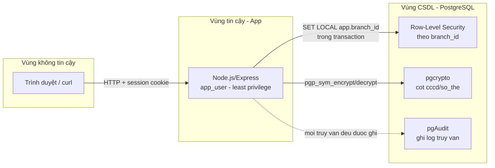

# Tổng hợp đồ án: Bảo mật cơ sở dữ liệu nhiều lớp trên PostgreSQL

> Tài liệu tổng hợp toàn bộ công việc đã thực hiện và công nghệ sử dụng, tính đến hiện tại.
> Cập nhật lần cuối: 19/09/2026.

## 1. Đề tài

**Xây dựng mô hình bảo mật cơ sở dữ liệu nhiều lớp trên PostgreSQL: phân quyền, mã hóa dữ liệu nhạy cảm, giám sát truy cập và khôi phục sau sự cố.**

Đồ án học phần An toàn Web và Cơ sở dữ liệu, xoay quanh 4 trụ cột phòng thủ:

1. **Phân quyền** — least-privilege qua DB role riêng biệt + Row-Level Security (RLS) theo chi nhánh.
2. **Mã hóa dữ liệu nhạy cảm** — mã hóa cột (CCCD, số thẻ) bằng `pgcrypto`, khóa sống ngoài database.
3. **Giám sát truy cập** — ghi log truy vấn ở tầng Postgres bằng `pgAudit`.
4. **Khôi phục sau sự cố** — backup/restore và Point-in-Time Recovery (PITR).

Luận điểm xuyên suốt (đã chứng minh được bằng demo thực tế): **defense-in-depth** — dù tầng ứng dụng có lỗ hổng (SQL Injection, IDOR), tầng database vẫn là lớp phòng thủ cuối cùng chặn được phần lớn thiệt hại.

Nhóm 3 người: Người A (threat model, app demo có lỗ hổng cố ý, RLS + mã hóa), Người B (least privilege, backup/PITR), Người C (giám sát pgAudit, phân tích log). Nội dung dưới đây chủ yếu là phần việc của **Người A**, đã hoàn thành 7/9 mục.

## 2. Công nghệ sử dụng

| Nhóm | Công nghệ | Vai trò trong đồ án |
|---|---|---|
| Hạ tầng | Docker, Docker Compose | Đóng gói PostgreSQL + pgAdmin, môi trường tái lập được trên mọi máy |
| Database | PostgreSQL 16 | Hệ quản trị CSDL chính |
| Database | `pgcrypto` (extension) | Mã hóa/giải mã cột nhạy cảm (`pgp_sym_encrypt`/`pgp_sym_decrypt`) |
| Database | `pgaudit` (extension, cài qua Dockerfile riêng vì image gốc không có) | Ghi log audit ở tầng Postgres (giám sát truy cập) |
| Database | Row-Level Security (RLS) | Giới hạn dữ liệu đọc được theo chi nhánh (`branch_id`), qua `CREATE POLICY` + session variable |
| Backend | Node.js + Express 4 | API server cho app demo |
| Backend | `pg` (node-postgres) 8.x | Kết nối PostgreSQL, dùng connection pool + client riêng theo transaction cho RLS |
| Backend | `express-session` | Quản lý phiên đăng nhập (lưu trong bộ nhớ, chỉ dùng cho demo) |
| Backend | `bcryptjs` | Băm mật khẩu nhân viên (chọn thay vì `bcrypt` vì đường dẫn project có ký tự `&` làm hỏng build native module) |
| Backend | `dotenv` | Quản lý biến môi trường / secret (bao gồm `ENCRYPTION_KEY`) |
| Dữ liệu mẫu | `@faker-js/faker` (locale `fakerVI`) | Sinh dữ liệu giả thực tế: ~6600 khách hàng, ~10000 đơn hàng, ~4000 thanh toán, chia đều 3 chi nhánh |
| Công cụ quản trị | pgAdmin | Giao diện quản trị DB (tùy chọn, không bắt buộc) |
| Phương pháp | STRIDE + Data Flow Diagram (Mermaid) | Threat modeling cho app demo |
| Bảo mật ứng dụng | Tham số hóa truy vấn (parameterized query) | Chuẩn an toàn cho hầu hết endpoint, đối lập với endpoint cố ý lỗi để demo |

## 3. Kiến trúc & luồng dữ liệu



Chi tiết đầy đủ (STRIDE, các trust boundary) nằm trong `docs/a-threat-model.md`.

## 4. Công việc đã hoàn thành

### Hạ tầng chung (Tuần 1)

- Docker Compose cho PostgreSQL 16 (build image riêng để cài thêm `pgaudit`) + pgAdmin.
- Thiết kế schema đầy đủ: `branches`, `staff`, `customers`, `orders`, `payments`, `audit_log`.
- Bật extension `pgcrypto`, `pgaudit`; cấu hình `pgaudit.log=write,ddl,role`.
- Tạo role `app_user` theo nguyên tắc least privilege (chỉ CRUD, không DDL).

### Threat model (Người A)

- Data Flow Diagram xác định 3 vùng tin cậy (browser / app / database) và ranh giới giữa chúng.
- Bảng STRIDE liệt kê các mối đe dọa tương ứng từng thành phần.
- Tài liệu: `docs/a-threat-model.md`.

### App demo (Node.js/Express)

- Kết nối PostgreSQL bằng role `app_user` (xác minh qua endpoint `/health` — không bao giờ chạy bằng superuser).
- Endpoint xác thực (`/auth/login`, `/auth/me`, `/auth/logout`) dùng session, mật khẩu băm bằng `bcryptjs`.
- Endpoint nghiệp vụ: `/customers`, `/orders` (parameterized, an toàn).
- Seed dữ liệu mẫu bằng Faker.js: ~6600 khách hàng, ~10000 đơn hàng, ~4000 thanh toán, chia đều 3 chi nhánh (Hà Nội / Hồ Chí Minh / Đà Nẵng).

### Lỗ hổng cố ý + kiểm chứng (Task 10)

- **SQL Injection (UNION-based)**: endpoint `GET /customers/search` cố ý nối chuỗi SQL trực tiếp. Đã khai thác thành công, đọc được `password_hash` (bcrypt hash) của toàn bộ nhân viên trong bảng `staff` — dù bảng đó không liên quan gì đến bảng `customers` mà endpoint đang truy vấn.
- **IDOR**: endpoint `GET /orders/:id` cố ý không kiểm tra quyền sở hữu/chi nhánh. Đã khai thác thành công: nhân viên chi nhánh Hà Nội xem được đơn hàng của chi nhánh Đà Nẵng chỉ bằng cách đổi số ID trên URL.

### Row-Level Security + mã hóa cột (Task 13 — lớp phòng thủ chính)

- Bật RLS + tạo policy giới hạn theo `branch_id` cho 3 bảng `customers`, `orders`, `payments` (`db/init/04-app-rls.sql`).
- Middleware `rls.js`: mỗi request mượn 1 connection riêng, mở transaction, gọi `set_config('app.branch_id', ..., true)` (tương đương `SET LOCAL`, an toàn với connection pool, tránh rò rỉ dữ liệu giữa các request).
- Tích hợp `pgp_sym_encrypt`/`pgp_sym_decrypt` cho cột `cccd`; khóa mã hóa (`ENCRYPTION_KEY`) chỉ tồn tại trong biến môi trường của app, không bao giờ lưu trong database.
- **Kết quả kiểm chứng thực tế**: chạy lại đúng payload IDOR đã khai thác ở Task 10 — sau khi bật RLS, cùng đoạn code `orders.js` (không sửa dòng nào) trả về **404 "Khong tim thay don hang"** thay vì lộ dữ liệu. Kiểm tra chéo với 2 tài khoản khác chi nhánh (`nv.hanoi` branch 1, `nv.hcm` branch 2) đều cho kết quả cô lập đúng. Truy vấn trực tiếp bằng `psql` xác nhận cột `cccd` trong database chỉ là chuỗi byte mã hóa, không đọc được nếu không có khóa.

### Data masking cho môi trường dev (Task 12)

- Script `db/init/05-mask-dev-data.sql` tạo schema `dev` riêng biệt, sao chép dữ liệu từ schema `public` nhưng che (mask) toàn bộ trường nhạy cảm: tên/email/SĐT chỉ giữ vài ký tự để "giống thật" phục vụ test UI, địa chỉ thay bằng placeholder, CCCD/số thẻ đặt `NULL` hoàn toàn.
- Mục đích: lập trình viên/tester không cần quyền truy cập dữ liệu khách hàng thật vẫn làm việc được.

## 5. Công việc còn lại

| Task | Nội dung | Ghi chú |
|---|---|---|
| #11 | Viết báo cáo pentest cho SQL Injection + IDOR | Portfolio/CV — dữ liệu kiểm chứng đã có đầy đủ, chỉ cần viết lại có cấu trúc |
| #14 | Trang cảnh báo đơn giản `/admin/alerts` | Phụ thuộc script phân tích log pgAudit của Người C (chưa làm) |
| B | Chi tiết least-privilege (readonly_user, admin_user), backup/restore, Point-in-Time Recovery (PITR), đo hiệu năng | Chưa bắt đầu trong phiên làm việc này |
| C | Cấu hình/tinh chỉnh pgAudit, viết script phân tích log | Chưa bắt đầu trong phiên làm việc này |

## 6. Cấu trúc thư mục dự án (tại thời điểm này)

```
dbsec-full/
├── docker-compose.yml
├── .env.example
├── db/
│   ├── Dockerfile                    # postgres:16 + pgaudit
│   └── init/
│       ├── 01-extensions.sql         # pgcrypto, pgaudit
│       ├── 02-schema.sql             # branches/staff/customers/orders/payments/audit_log
│       ├── 03-app-role.sql           # role app_user (least privilege)
│       ├── 04-app-rls.sql            # RLS theo chi nhánh (Task 13)
│       └── 05-mask-dev-data.sql      # data masking cho dev (Task 12)
├── docs/
│   ├── tuan1-nghien-cuu.md
│   ├── a-threat-model.md
│   └── tong-hop-do-an.md             # file này
└── app/
    ├── package.json
    ├── .env.example
    ├── scripts/
    │   ├── seed-staff.js
    │   └── seed-data.js              # Faker.js
    └── src/
        ├── app.js
        ├── server.js
        ├── db.js
        ├── middleware/
        │   ├── requireAuth.js
        │   └── rls.js                # Task 13
        └── routes/
            ├── auth.js
            ├── customers.js          # co /search (SQLi co y) + ma hoa cccd
            └── orders.js             # co IDOR co y
```
