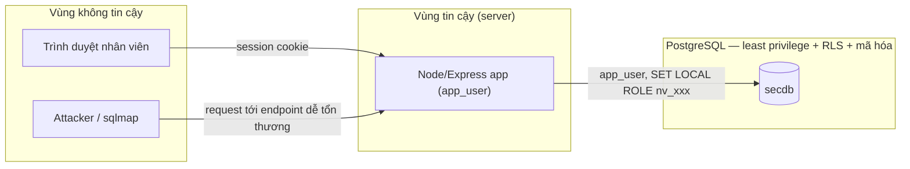

# Threat model & Data Flow — app/ demo

Hiểu luồng dữ liệu và ranh giới tin cậy trước khi đọc code — đúng thứ tự thiết
kế bảo mật chuẩn.

## Data Flow Diagram

Ranh giới tin cậy quan trọng nhất nằm giữa **app** và **database**. Giả định
thiết kế: app có thể bị khai thác hoàn toàn (SQL Injection, IDOR — xem
`app/README.md`), nhưng các cơ chế ở tầng DB (Row-Level Security, mã hóa cột,
least privilege theo mô hình whitelist) là lớp phòng thủ độc lập, không dựa
vào giả định "app luôn kiểm tra đúng".

## STRIDE cơ bản

| Loại đe dọa | Ví dụ trong hệ thống | Kiểm soát tương ứng |
| --- | --- | --- |
| Spoofing | Giả mạo tài khoản nhân viên | `bcrypt` cho `app.staff.password_hash`, session xác thực trước khi `SET LOCAL ROLE` |
| Tampering | Sửa `id` trong URL để xem đơn hàng chi nhánh khác (IDOR) | Row-Level Security ở tầng DB (`branch_isolation` policy) — chặn được kể cả khi app quên kiểm tra quyền |
| Repudiation | Nhân viên chối đã đọc/sửa dữ liệu | pgAudit ghi mọi câu lệnh + mọi lần `SET ROLE`, quy trách nhiệm theo `pid` phiên (xem CLAUDE.md mục "Log") |
| Information Disclosure | SQL Injection dump `app.customers`/`app.staff` | Mã hóa cột `cccd`/`card_token` bằng `app.encrypt_text()` — dump được nhưng chỉ thấy bytea vô nghĩa; riêng `app.staff` không bật RLS nên vẫn là mục tiêu khả thi của UNION-based SQLi (xem `app/README.md`) |
| Denial of Service | Truy vấn nặng làm chậm hệ thống | `statement_timeout`/`idle_in_transaction_session_timeout` ở mức role (`postgres/init/02_roles.sh`); tấn công DoS diện rộng ngoài phạm vi đồ án |
| Elevation of Privilege | App bị chiếm quyền, thử `DROP TABLE`/đổi quyền | `app_user` không sở hữu object nào, không có DDL, `NOINHERIT` (least privilege) |

## Ghi chú cho báo cáo

Điểm cốt lõi: thiết kế này theo tinh thần **defense in depth** — không có
kiểm soát nào một mình là đủ, mỗi lớp bù đắp cho khả năng lớp trước bị vượt
qua. Hai lỗ hổng cố ý trong `app/` (SQLi, IDOR) tồn tại chính là để **đo được**
luận điểm này bằng thực nghiệm, thay vì chỉ nói suông: cùng một request khai
thác, kết quả khác nhau tùy RLS/whitelist ở tầng DB có đứng sau hay không.
