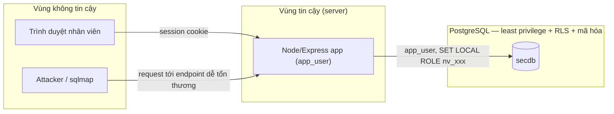

# Threat model & Data Flow — app/ demo

Hiểu luồng dữ liệu và ranh giới tin cậy trước khi đọc code — đúng thứ tự thiết
kế bảo mật chuẩn.

## Data Flow Diagram

```mermaid
flowchart LR
    subgraph Untrusted["Vùng không tin cậy"]
        U["Trình duyệt nhân viên"]
        ATT["Attacker / sqlmap"]
    end
    subgraph Trusted["Vùng tin cậy (server)"]
        APP["Node/Express app (app_user)"]
    end
    subgraph DBZone["PostgreSQL — least privilege + RLS + mã hóa"]
        PG[("secdb")]
    end

    U -->|"session cookie"| APP
    ATT -->|"request tới endpoint dễ tổn thương"| APP
    APP -->|"app_user, SET LOCAL ROLE nv_xxx"| PG
```

Ranh giới tin cậy quan trọng nhất nằm giữa **app** và **database**. Giả định
thiết kế: app có thể bị khai thác hoàn toàn (SQL Injection, IDOR — xem
`app/README.md`), nhưng các cơ chế ở tầng DB (Row-Level Security, mã hóa cột,
least privilege theo mô hình whitelist) là lớp phòng thủ độc lập, không dựa
vào giả định "app luôn kiểm tra đúng".

## STRIDE cơ bản

| Loại đe dọa | Ví dụ trong hệ thống | Kiểm soát tương ứng |
| --- | --- | --- |
| Spoofing | Giả mạo tài khoản nhân viên | `bcrypt` cho `app.staff.password_hash`, so mật khẩu trong DB (`app.verify_staff_login()`), session xác thực trước khi `SET LOCAL ROLE` |
| Tampering | Sửa `id` trong URL để xem đơn hàng chi nhánh khác (IDOR) | Row-Level Security ở tầng DB (`branch_isolation` policy) — chặn được kể cả khi app quên kiểm tra quyền |
| Repudiation | Nhân viên chối đã đọc/sửa dữ liệu | pgAudit ghi mọi câu lệnh + mọi lần `SET ROLE`, quy trách nhiệm theo `session_id` của phiên (xem CLAUDE.md mục "Log") |
| Information Disclosure | Nghe lén / xen giữa đường app → DB, nơi CCCD đã giải mã đi qua | TLS 1.3 bắt buộc (`hostnossl ... reject` trong `pg_hba.conf`); client xác thực server bằng CA của lab (verify-full) nên chứng chỉ tự ký của kẻ xen giữa bị từ chối |
| Information Disclosure | Bản sao lưu / WAL archive bị chép đi (máy sao lưu, ổ ngoài, kho offsite) | Mọi thứ rời database đều mã hóa bằng khóa sao lưu riêng (`postgres/backup-crypt.sh`); lộ khóa đó thì CCCD bên trong vẫn là ciphertext của lớp 2 |
| Tampering | Cấy segment WAL / bản sao lưu giả để PITR khôi phục ra dữ liệu do kẻ tấn công chọn | Mã hóa có kiểm tra toàn vẹn (MDC): không có khóa thì không tạo được file giải mã hợp lệ; `restore_command` không nhận segment rõ |
| Information Disclosure | SQL Injection dump `app.customers`/`app.staff` | Mã hóa cột `cccd`/`card_token` bằng `app.encrypt_text()` — dump được nhưng chỉ thấy bytea vô nghĩa; riêng `app.staff` không bật RLS nên được bảo vệ bằng quyền mức cột — không role nghiệp vụ nào đọc được `password_hash`, UNION-based SQLi bị từ chối (xem `app/README.md`) |
| Denial of Service | Truy vấn nặng làm chậm hệ thống | `statement_timeout`/`idle_in_transaction_session_timeout` ở mức role (`postgres/init/02_roles.sh`); tấn công DoS diện rộng ngoài phạm vi đồ án |
| Elevation of Privilege | App bị chiếm quyền, thử `DROP TABLE`/đổi quyền | `app_user` không sở hữu object nào, không có DDL, `NOINHERIT` (least privilege). Tài khoản quản trị bị chiếm (tắt RLS, `GRANT ... TO PUBLIC`, hàm `SECURITY DEFINER`, thử `SUPERUSER`): lớp 1 không chặn được câu lệnh hợp lệ của chủ sở hữu, analyzer phát hiện bằng rule `PRIVILEGE_ESCALATION` |

## Ghi chú cho báo cáo

Điểm cốt lõi: thiết kế này theo tinh thần **defense in depth** — không có
kiểm soát nào một mình là đủ, mỗi lớp bù đắp cho khả năng lớp trước bị vượt
qua. Hai lỗ hổng cố ý trong `app/` (SQLi, IDOR) tồn tại chính là để **đo được**
luận điểm này bằng thực nghiệm, thay vì chỉ nói suông: cùng một request khai
thác, kết quả khác nhau tùy RLS/whitelist ở tầng DB có đứng sau hay không.
